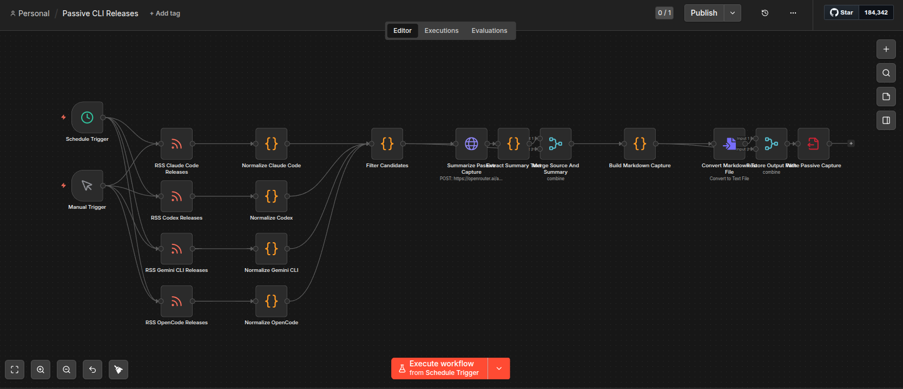
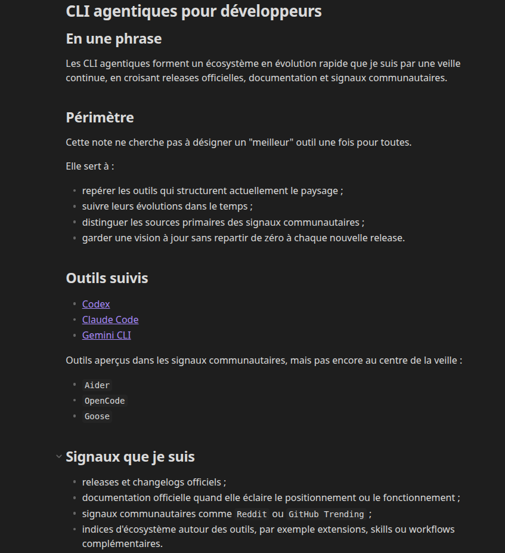

# Veille Technologique : CLI Agentiques
## et Gestion PKM déléguée à l'IA (LLM Wiki)

Présenté par Virgile Wautier - Cours 5XVTE

  
    Appuyez sur Espace pour commencer <carbon:arrow-right class="inline"/>
  

---
layout: default
---

# 1. Introduction & Contexte

- **La Solution (LLM Wiki de Karpathy)** : Un modèle où l'IA agit comme le "bibliothécaire" d'un wiki persistant en Markdown : elle lit, résume, crée les liens et met à jour les index. Déléguer cette maintenance lourde (le "bookkeeping") via des skills locaux (`/ingest`, `/query`, `/lint`) libère l'humain de la friction pour se concentrer sur l'analyse critique.
- **Le Sujet de Veille** : Les CLI Agentiques (Claude Code, Codex, OpenCode, Gemini CLI...).
- **L'Enjeu** : Mener une **veille continue de l'état de l'art**. Le but n'est pas de prendre une décision finale pour élire "le meilleur" outil, mais de suivre de manière soutenable un écosystème en évolution très rapide.

<!--
Notes:
- Rappeler l'enjeu du cours : savoir, comprendre, agir.
- Citer l'idée de Karpathy : le LLM Wiki permet à la base de connaissance de croître de manière cumulative, évitant de toujours repartir de zéro comme avec le RAG traditionnel.
-->

---
layout: two-cols-header
---

# 2. Méthodologie & Collecte

Automatisation de la veille passive pour maximiser la découverte sans friction (Push -> Pull).

::left::

**Sources & Écosystème**
- **Primaires** : GitHub Releases, documentations officielles.
- **Secondaires** : Signaux communautaires, Reddit.

**Processus n8n**
- Workflows réguliers :
  - `passive-cli-releases`
  - `github-trending-weekly`
- Dépôt automatique de captures Markdown standardisées dans `raw/passive/`.

::right::

  

<!--
Notes:
- Montrer que n8n permet d'éviter de courir après l'information.
- Séparation stricte entre les sources (raw/) et les notes finales (wiki/notes/).
-->

---
layout: two-cols-header
---

# 3. Résultats : L'état de l'art des CLI Agentiques

L'écosystème évolue vers des usages multi-agents et la spécialisation des outils.

::left::

**Acteurs Majeurs (Benchmark Terrain)**
- **Claude Code** : Excellent pour l'architecture complexe, mais fermé, coûteux (lourd en tokens).
- **Codex** : Plus généreux/efficace sur les tokens, **Open Source** (Apache 2.0).
- **Gemini CLI** : Le meilleur point d'entrée grâce à son offre gratuite généreuse.
- **OpenCode / Aider** : Acteurs **Open Source** phares. Liberté totale de modèle. **Approche BYOK** (*Bring Your Own Key*).

::right::

  

<!--
Notes:
- L'outil unique n'existe pas : les utilisateurs avancés combinent (ex: Claude pour l'archi, un autre moins cher pour déboguer).
- Insister sur OpenCode et la liberté d'utiliser les tokens API (BYOK).
-->

---
layout: default
---

# 4. Analyse Critique & Biais

La veille automatisée demande un filtrage critique (Système 2 de Kahneman) :

- **Biais de popularité (Bandwagon effect)** : On observe une forte tendance de la communauté (visible notamment dans les *GitHub Trending*) à surreprésenter **Claude Code** comme "le" CLI ultime.
- **Limites de la démarche** : Cette veille sur les CLI agentiques **n'a pas pour but de choisir le meilleur outil absolu**. Il s'agit d'un suivi continu des mises à jour, car l'outil parfait dépend du contexte et du besoin à un instant T.
- **Limites de l'IA (Hallucinations)** : Un agent LLM (lors du workflow `ingest`) peut inventer des liens qui n'existent pas ou tirer des conclusions hâtives lors du résumé d'une source. La validation humaine reste indispensable.

<!--
Notes:
- L'analyse critique est cruciale pour le cours.
- Rappeler qu'on garde un oeil sur le biais de confirmation lorsqu'on lit des avis enthousiastes sur Reddit ou GitHub.
-->

---
layout: default
---

# 5. Synthèse & 6. Démonstration

**Recommandations**
- **Adopter** : L'automatisation du PKM via l'approche *LLM Wiki* pour alléger la maintenance du vault.
- **Expérimenter** : L'utilisation concrète des CLI Agentiques et des Skills IA dans les tâches de développement quotidiennes.
- **Surveiller** : Les nouvelles mises à jour et évolutions des workflows en tant que développeur, l'émergence des sous-agents collaboratifs et la gestion de la mémoire.

  

    <h2 class="!mt-0 !mb-2 text-blue-600 dark:text-blue-400">Démonstration du système (Live)</h2>
    

      1. Vue de l'agrégation <strong>n8n</strong> configurée. 
      2. Le <strong>Vault Obsidian</strong> structuré (sources <code>raw/</code> et notes <code>wiki/</code>). 
      3. Les <strong>automatisations en place</strong> (exécution d'un skill <code>/lint</code> ou <code>/query</code>).
    

  

<!--
Notes:
- Remercier l'audience et lancer la démo live de 5 min du système.
- Montrer que le processus est fluide de bout en bout.
-->
