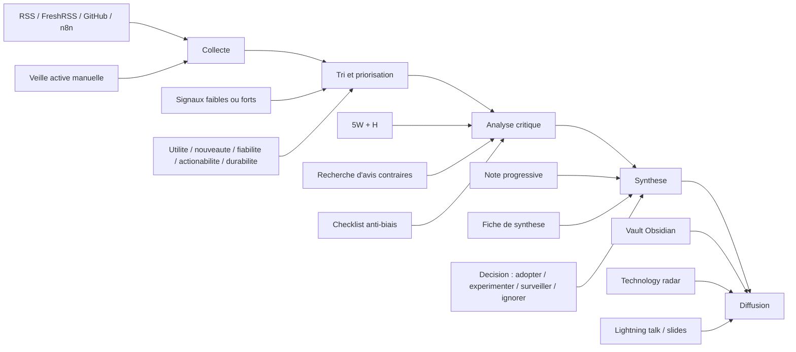

# Pipeline de veille

## En une phrase
Le cours attend un processus de veille structuré qui va de la collecte à la diffusion, avec une étape explicite d'analyse critique et de synthèse exploitable.

## Pipeline du cours

## Comment ce pipeline s'applique a mon systeme

- `Collecte`
  - la veille passive arrive par `RSS`, `GitHub Releases` et `GitHub Trending` via `n8n`
  - les captures automatiques sont stockees dans `raw/passive/`
  - la veille active est deposee manuellement dans `raw/active/`

- `Tri et priorisation`
  - les captures restent d'abord en `status: a-traiter`
  - seules les entrees utiles deviennent des notes
  - `GitHub Trending` sert surtout de detecteur de signaux, pas de preuve a lui seul

- `Analyse critique`
  - chaque sujet retenu doit etre relu avec `5W + H`
  - la grille de pertinence du cours aide a separer le signal du bruit
  - les biais doivent etre notes, surtout le biais de popularite sur GitHub Trending

- `Synthese`
  - la vraie connaissance finale vit dans `wiki/notes/`
  - une note doit reformuler avec ses propres mots
  - la synthese doit aboutir a une decision claire : `Adopter`, `Experimenter`, `Surveiller` ou `Ignorer`

- `Diffusion`
  - le vault sert de support de demonstration
  - `technology-radar.md` aide a visualiser les decisions
  - la presentation finale peut reprendre ce pipeline comme slide de methode

## Pourquoi cette note est importante pour le cours

- elle couvre `AA2` : collecte, analyse, synthese, diffusion
- elle couvre `AA3` : definition d'un processus de veille structure
- elle soutient `AA4` : systeme personnel fonctionnel
- elle aide aussi `DM3` : clarte de la presentation avec un schema simple

## Liens

- [[rituals]]
- [[technology-radar]]
- [[bias-journal]]
- [[pkm|PKM]]
- [[wiki/notes/llm-wiki|LLM Wiki]]

## Sources

- `5XVTE.md` : grille d'evaluation et acquis d'apprentissage du cours
- `veille.md` : support de cours sur la collecte, le PKM, l'analyse, la synthese et la diffusion
