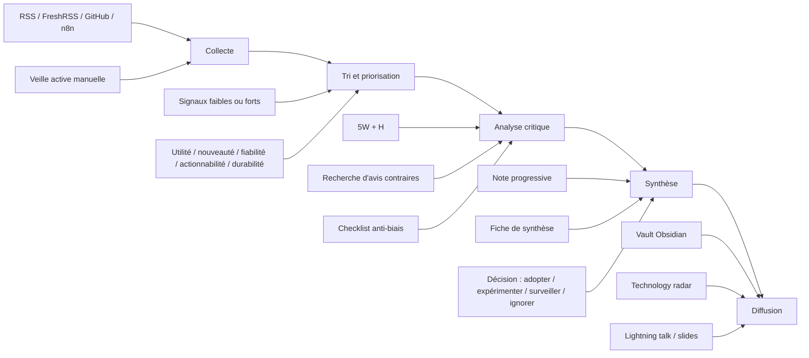

# Pipeline de veille

## En une phrase
Le cours attend un processus de veille structuré qui va de la collecte à la diffusion, avec une étape explicite d'analyse critique et de synthèse exploitable.

## Pipeline du cours

## Comment ce pipeline s'applique à mon système

- `Collecte`
  - la veille passive arrive par `RSS`, `GitHub Releases` et `GitHub Trending` via `n8n`
  - les captures automatiques sont stockées dans `raw/passive/`
  - la veille active est déposée manuellement dans `raw/active/`

- `Tri et priorisation`
  - les captures restent d'abord en `status: a-traiter`
  - seules les entrées utiles deviennent des notes
  - `GitHub Trending` sert surtout de détecteur de signaux, pas de preuve à lui seul

- `Analyse critique`
  - chaque sujet retenu doit être relu avec `5W + H`
  - la grille de pertinence du cours aide à séparer le signal du bruit
  - les biais doivent être notés, surtout le biais de popularité sur GitHub Trending

- `Synthèse`
  - la vraie connaissance finale vit dans `wiki/notes/`
  - une note doit reformuler avec ses propres mots
  - la synthèse doit aboutir à une décision claire : `Adopter`, `Expérimenter`, `Surveiller` ou `Ignorer`

- `Diffusion`
  - le vault sert de support de démonstration
  - `technology-radar.md` aide à visualiser les décisions
  - la présentation finale peut reprendre ce pipeline comme slide de méthode

## Pourquoi cette note est importante pour le cours

- elle couvre `AA2` : collecte, analyse, synthèse, diffusion
- elle couvre `AA3` : définition d'un processus de veille structuré
- elle soutient `AA4` : système personnel fonctionnel
- elle aide aussi `DM3` : clarté de la présentation avec un schéma simple

## Liens

- [[rituals]]
- [[technology-radar]]
- [[bias-journal]]
- [[pkm|PKM]]
- [[wiki/notes/llm-wiki|LLM Wiki]]

## Sources

- `5XVTE.md` : grille d'évaluation et acquis d'apprentissage du cours
- `veille.md` : support de cours sur la collecte, le PKM, l'analyse, la synthèse et la diffusion