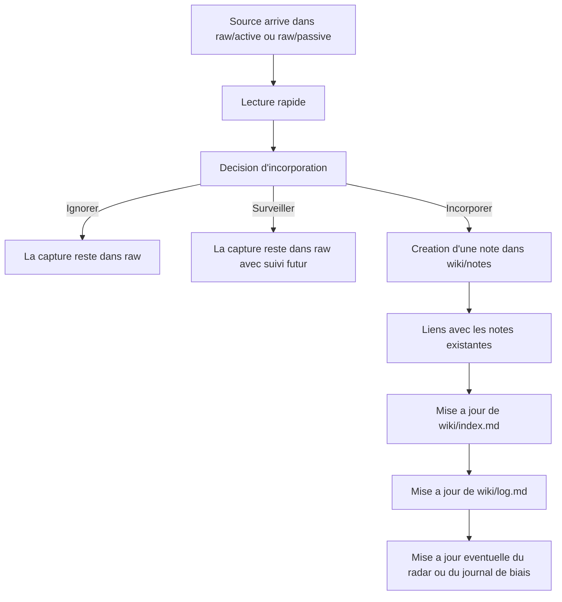

# Pipeline d'incorporation d'une note

## En une phrase
Quand une source entre dans `raw/active/` via Obsidian Clipper ou dans `raw/passive/` via `n8n`, elle ne devient une vraie note que si elle passe un tri simple puis une reformulation en note de veille dans `wiki/notes/`.

## Pipeline pratique

## Cas 1 : source ajoutee avec Obsidian Clipper

Exemple :

- article web ;
- gist ;
- thread ;
- documentation ;
- billet de blog.

Processus :

1. la source arrive dans `raw/active/`
2. lire le contenu et identifier :
   - le sujet principal
   - le type de source
   - le niveau de confiance
3. ouvrir [[template-decision-incorporation]]
4. decider :
   - `Ignorer`
   - `Surveiller`
   - `Incorporer`
5. si la decision est `Incorporer`, creer une note avec [[template-note-de-veille]]

## Cas 2 : source issue de la veille passive

Exemple :

- capture RSS ;
- release GitHub ;
- GitHub Trending weekly ;
- article detecte automatiquement par `n8n`.

Processus :

1. la capture arrive dans `raw/passive/`
2. verifier si elle est :
   - fiable
   - utile
   - actionnable
3. ouvrir [[template-decision-incorporation]]
4. si le score est suffisant, creer une note dans `wiki/notes/`

## Regle importante

Une capture n'est pas encore une note.

La note finale doit :

- reformuler avec tes propres mots ;
- extraire l'essentiel ;
- relier le sujet au reste du vault ;
- aboutir a une decision claire.

## Mini checklist operative

Avant de creer une note, verifier :

- ai-je compris l'idee principale ?
- est-ce pertinent pour mon sujet de veille ?
- puis-je relier cette note a au moins une autre note existante ?
- puis-je finir par `Adopter`, `Experimenter`, `Surveiller` ou `Ignorer` ?

Si la reponse est majoritairement `non`, ne pas creer la note.

## Ce que je fais concretement quand j'incorpore

1. choisir un titre clair en `kebab-case`
2. creer la note dans `wiki/notes/`
3. remplir le gabarit de [[template-note-de-veille]]
4. ajouter `2 a 3` liens internes si possible
5. ajouter les sources
6. mettre a jour `wiki/index.md`
7. ajouter une entree dans `wiki/log.md`
8. si necessaire, ajuster :
   - [[technology-radar]]
   - [[bias-journal]]

## Exemple simple

- capture : `raw/active/Thread by @karpathy.md`
- decision : `Incorporer`
- note finale possible : `wiki/notes/llm-wiki.md`

Autrement dit :

- `raw/active/Thread by @karpathy.md` = source
- `wiki/notes/llm-wiki.md` = connaissance integree

## Liens utiles

- [[template-decision-incorporation]]
- [[template-note-de-veille]]
- [[pipeline-de-veille]]
- [[technology-radar]]
